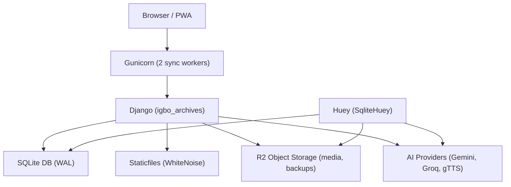

## Root & Project-Level Audit (Igbo Archives Platform)

### 1. High-Level Architecture & Constraints

- **Stack**: Django 5.x, Python 3.11+ (code), uv/pyproject targeting Python 3.12, SQLite + WAL, Huey (SQLite backend), Gunicorn, WhiteNoise, Tailwind, HTMX, PWA, web push, AI services (Gemini, Groq, gTTS).
- **Deployment**: Single **1 GB RAM VM** on GCP, using systemd services:
  - Gunicorn with 2 sync workers, `preload_app=True`, `max_requests=500 (+ jitter)` for memory control.
  - Separate Huey service for background jobs.
- **Storage**:
  - SQLite DB in `BASE_DIR/db.sqlite3` with WAL tuning via `igbo_archives/sqlite_wal.py`.
  - Cloudflare R2 via `django-storages` for media and DB backups, WhiteNoise for staticfiles.
- **Security & UX**:
  - CSP via `django-csp`, Turnstile, allauth (email-based auth + Google), threaded comments, SEO via django-meta, PWA via django-pwa, webpush for notifications.

#### 1.1 Architecture Diagram

#### 1.2 Global Strengths

- **Designed for low memory**:
  - SQLite with WAL and tuned PRAGMAs (`synchronous=NORMAL`, `cache_size=-32000` ≈ 32 MB, `temp_store=MEMORY`, `mmap_size=64 MB`, `busy_timeout=5s`).
  - Gunicorn `workers=2` and `max_requests(+jitter)` keep resident memory per worker bounded.
  - Huey configured with `results=False`, `store_none=True`, `utc=True`, and a dedicated `huey.db`.
  - Uploads forced through `TemporaryFileUploadHandler` and capped at 5 MB to avoid RAM blowups.
- **Production-grade security defaults**:
  - Strict production-only security block in settings (HSTS, SSL redirect, secure cookies, CSP).
  - Turnstile keys for forms + webpush VAPID and PWA setup.
  - `SECRET_KEY` is strictly required at start-up.
- **Operational discipline**:
  - GitHub Actions deploy workflow using `uv sync`, migrations, `createcachetable`, `collectstatic`, and uv cache cleanup.
  - Clear separation of environments via `DEBUG` and env vars for services (AI, email, R2, analytics, Paystack).
- **Modern frontend**:
  - Tailwind 3.4 with tight `content` globs and a minimal heritage palette.
  - Self-hosted fonts and FontAwesome via npm build pipeline.

#### 1.3 Global Risks & Inconsistencies

- **Python version mismatch**:
  - `pyproject.toml` and `uv.lock` require **Python >= 3.12**.
  - `manage.py` enforces **Python 3.11+**.
  - Deployment workflow sets `UV_PYTHON=python3.12`.
  - **Impact**: Local developers on 3.11 may hit resolution differences vs production on 3.12. This is more of a tooling inconsistency than a runtime bug, but it should be aligned.
- **Database backend inconsistency in settings**:
  - `DATABASES['default']` in `settings.py` is configured as **SQLite**, but `STORAGES['default']` is `S3Boto3Storage`. That is correct for media, but DB is still local SQLite; this dual use of the term “default” in STORAGES vs DATABASES can be confusing.
- **Single-point-of-failure components**:
  - Single SQLite DB for application and single `huey.db` for tasks; any DB corruption or disk exhaustion affects everything.
  - Database cache uses the same SQLite DB (via `createcachetable`), further tying reliability of caching to primary DB health.
- **Monitoring & observability**:
  - Logging is console-based (`LOGGING` configured for console handlers and Gunicorn logs to `-`), which is good for low memory but there is no central log aggregation or alerting.
  - No explicit error-tracking integration (e.g. Sentry), which you’ve chosen to avoid to stay single-VM and infra-light; this means you must rely on logs + manual inspection.
- **Environment configuration pitfalls**:
  - `ALLOWED_HOSTS = ['*']` even in production; CSP mitigates some risk but host header hardening is recommended.
  - `CSRF_TRUSTED_ORIGINS` is built from either `REPLIT_DEV_DOMAIN` or a comma-split env var (`CSRF_TRUSTED_ORIGINS` defaulting to `https://igboarchives.com.ng`), which is fine but can misbehave if env uses spaces or trailing commas.

### 2. `igbo_archives` Package Audit

#### 2.1 URL Configuration (`igbo_archives/urls.py`)

- **Responsibilities**:
  - Central URL router for all apps.
  - Exposes:
    - Custom admin at `/igbo-secure-admin/`.
    - Root PWA and core pages (`''` includes `pwa.urls`, then `core.urls`).
    - Auth via `allauth` under `/accounts/`.
    - Users under `/profile/`, API under `/api/`, Archives under `/archives/`, Insights under `/insights/`, Books under `/books/`, AI under `/ai/`.
    - Comments via `django_comments` under `/comments/`.
    - Web push under `/webpush/` namespace.
    - Combined sitemaps at `/sitemap.xml` linking `StaticPagesSitemap`, `ArchiveSitemap`, `InsightSitemap`, `BookSitemap`, `UserProfileSitemap`.
  - Development-only static media serving under `DEBUG` using `static(settings.MEDIA_URL, document_root=settings.MEDIA_ROOT)`.

**Strengths**

- Clear and conventional URL layout; each domain area has a dedicated prefix.
- All heavy-lifting (PWA, comments, webpush, allauth) is delegated to their own URLconfs; this keeps the root concise.
- Sitemap aggregation is centralized and uses named sitemaps; this is good for SEO.

**Risks / Improvement Opportunities**

- Root includes `pwa.urls` then `core.urls` at `''`:
  - You need to ensure no conflicting root patterns or unexpected shadowing between PWA and core home page.
- No explicit `handler400/403/404/500` declarations:
  - You have custom templates (`403.html`, `404.html`, `500.html`) at the project level, but explicit handlers in `urls.py` (or via settings) would make the mapping obvious and testable.

#### 2.2 ASGI & WSGI (`igbo_archives/asgi.py`, `igbo_archives/wsgi.py`)

- Both ASGI and WSGI entrypoints:
  - Set `DJANGO_SETTINGS_MODULE` to `igbo_archives.settings`.
  - **Import and call** `enable_wal_mode()` from `igbo_archives.sqlite_wal` **before** creating the application.

**Strengths**

- WAL mode is guaranteed to be enabled whenever a process starts, so you don’t depend on a manual PRAGMA setting or migrations.
- The logic is idempotent and safe:
  - If `db.sqlite3` does not exist yet, `enable_wal_mode()` returns early (no error).
  - Connection is created, PRAGMAs are executed, then closed.

**Risks / Improvement Opportunities**

- `enable_wal_mode()` is executed **on every process start** for both Gunicorn workers (via preloading) and for any management command that uses ASGI/WSGI:
  - Overhead is small but not zero; currently acceptable.
  - Under heavy deployment/migration cycles this is fine, but you must ensure that:
    - The DB file is writable; otherwise the PRAGMAs will silently fail (currently no logging).
  - **Improvement**: Add explicit logging in debug mode or a safe warning log on PRAGMA failure, without raising hard exceptions.
- `temp_store=MEMORY` and `cache_size=-32000` are tuned globally:
  - **Good**: helps read performance given 1 GB RAM and relatively small dataset.
  - **Risk**: if the dataset grows significantly or queries become heavy, 32 MB of cache per process may be high for 1 GB, especially with multiple Gunicorn workers + Huey + other processes.
  - **Suggestion**: monitor RSS per process and be ready to drop `cache_size` slightly if memory pressure becomes observable (e.g. 16–24 MB).

#### 2.3 Settings (`igbo_archives/settings.py`)

Key global aspects already noted, plus detailed findings:

- **Security & Auth**:
  - `SECRET_KEY` must be provided; otherwise a `ValueError` is raised at import time. This is strict and correct.
  - `ALLOWED_HOSTS = ['*']`:
    - **For production**, you should specify your real domains explicitly (e.g. `['igboarchives.com.ng', 'www.igboarchives.com.ng']`), and keep `'*'` only for development.
  - Authentication via allauth:
    - Email-required, email verification mandatory for primary flows; Google social login auto-signed, with verification disabled for social because providers already verified the email.
  - Production security block under `if not DEBUG:` is solid (HSTS, SSL, secure cookies, CSP, proxy header).
- **Storage & Static**:
  - `STORAGES` uses:
    - `default` as S3Boto3 linked to R2 for media.
    - `staticfiles` as WhiteNoise’s `CompressedManifestStaticFilesStorage`.
    - `dbbackup` as separate S3Boto3 to a dedicated `igboarchives-backup` bucket.
  - `MEDIA_URL` is pointed at `https://{R2_CUSTOM_DOMAIN}/` if configured, ensuring direct media access.
- **Caching**:
  - Database cache via `DatabaseCache` stored in table `cache_table`, with `MAX_ENTRIES=500`.
  - This is intentionally small to avoid DB bloat under 1 GB RAM.
  - **Tradeoff**: Frequent cache churn and potential increased DB load under heavy read patterns, but this may be acceptable for your traffic profile.
- **Huey**:
  - `SqliteHuey` with its own file `huey.db`:
    - `immediate=DEBUG` makes development easier.
    - `results=False` reduces DB writes and storage overhead.
- **Uploads & Memory**:
  - `DATA_UPLOAD_MAX_MEMORY_SIZE = FILE_UPLOAD_MAX_MEMORY_SIZE = 5 MB` and only `TemporaryFileUploadHandler` is used.
  - This is excellent for a 1 GB VM; large files are streamed to disk, not memory.

**Settings-Level Risks / Inconsistencies**

- **`ALLOWED_HOSTS` wildcard** (as above).
- **CSP allowances**:
  - `CSP_SCRIPT_SRC` includes `'unsafe-inline'` and `'unsafe-eval'`, plus Google domains and AdSense.
  - Given practical needs (editor/analytics/ads), this is understandable, but:
    - You should ensure no unnecessary inline scripts in your own templates.
    - Consider migrating to hashed CSP for the most critical entry points over time.
- **Database Cache Table**:
  - The deploy workflow runs `createcachetable` each deployment, which is generally safe.
  - If schema or location changes, ensure the table is on the same DB as `default` and monitored for growth.

#### 2.4 Gunicorn Configuration (`gunicorn_config.py`)

- **Core Config**:
  - `workers = 2`, `worker_class = "sync"`, `preload_app = True`.
  - `max_requests = 500`, `max_requests_jitter = 50` for periodic recycling.
  - Access and error logs to stdout/stderr with `loglevel="info"`.

**Strengths**

- `worker_class="sync"` is the correct choice for SQLite to avoid async/greenlet issues with DB connections.
- Preloading is good for startup cost and can reduce memory duplication with copy-on-write, provided:
  - You have enough headroom for two processes + master.
  - You’re not holding large global data structures.
- `max_requests` cycling mitigates memory leaks in long-lived workers.

**Risks / Improvement Opportunities**

- With only 1 GB RAM, you should monitor the **peak RSS** of each worker + Huey:
  - If each worker stabilizes under ~150–200 MB and Huey is light, `workers=2` is safe.
  - If you approach swap usage, consider dropping to `workers=1` and using more aggressive caching / database tuning.
- `backlog=256` and `worker_connections=100` are moderate defaults, but in a 1 GB environment, protecting the DB and workers from overload is more important than serving spikes.

#### 2.5 Deployment Workflow (`.github/workflows/deploy.yaml`)

- **Steps**:
  - Checkout.
  - SSH to GCP VM.
  - `git pull origin main` with `pull.rebase=false`.
  - `uv sync` with `UV_PYTHON=python3.12`.
  - `uv run python manage.py migrate` and `createcachetable`.
  - `uv run python manage.py collectstatic --noinput`.
  - `uv cache clean --force`.
  - Restart `igboarchives` and `igboarchives-huey` systemd services using sudo password secret.

**Strengths**

- Fully automated path from commit to deployed, migrated, and static-compiled app.
- `uv cache clean --force` defends against disk bloat from resolver cache, which matters on small disks.
- Explicitly ensures `cache_table` exists on each deploy.

**Risks / Improvement Opportunities**

- The workflow **assumes**:
  - A consistent environment file or env var setup on the VM (not enforced or checked here).
  - That migrations are always safe to run online (no explicit maintenance window or health checks).
- No health-check or smoke test after restart:
  - On a 1 GB VM, a misconfiguration could cause OOM or crash loops without early detection.
  - Consider a simple HTTP health check step after restart.

### 3. Global Improvement Checklist (Root & Project Level)

#### 3.1 Must-Fix / High Priority (Pre-Production)

- ✅ **Tighten `ALLOWED_HOSTS`**:
  - ✅ Replace `['*']` with your actual production domains and add localhost only for dev.
- ✅ **Align Python versions**:
  - ✅ Choose **Python 3.12** end-to-end:
    - ✅ Update `manage.py` error message to require 3.12+ (to match uv and pyproject).
    - Ensure local development instructions mention 3.12 explicitly.
- ✅ **Add error handlers in `urls.py`**:
  - ✅ Define `handler400`, `handler403`, `handler404`, `handler500` to map to appropriate core error views or standard handlers that use your custom templates.

#### 3.2 Should-Fix Soon After Launch

- **Improve WAL logging & resilience**:
  - In `enable_wal_mode()`:
    - Log PRAGMA failures (only in debug or at `WARNING` level) to assist debugging DB issues.
    - Optionally wrap PRAGMA calls in small `try/except` blocks so any PRAGMA that fails does not prevent the app from booting.
- **Review cache sizing**:
  - Confirm that `cache_size=-32000` is acceptable given real production memory metrics.
  - If memory pressure is observed, lower the cache size (e.g. 16 MB) and rely a bit more on OS-level caching.
- **Add a simple health endpoint & CI smoke test**:
  - Expose a minimal “OK” view (no DB access) and have GitHub Actions hit it via curl after restart.

#### 3.3 Nice-to-Have / Medium-Term

- **Refine CSP over time**:
  - Gradually reduce reliance on `'unsafe-inline'` by moving inline scripts to external JS and using nonces or hashes where practical.
- **Add lightweight error logging discipline**:
  - Since you do not want external infra, ensure:
    - systemd journals are rotated and monitored.
    - Application-level logs are concise and do not dump large payloads (e.g. AI responses).
- **Document operational runbooks**:
  - Add root-level docs describing:
    - How to rotate AI keys.
    - How to handle Huey queues and long tasks.
    - How to recover from DB corruption using dbbackup on R2.

---

This root-level and `igbo_archives` package audit establishes that the platform is thoughtfully tuned for a 1 GB VM, with strong security defaults and a modern toolchain. The main inconsistencies are around Python version alignment and host configuration, plus some opportunities to add more observability and resilience around SQLite WAL behavior and deployment health checks.

